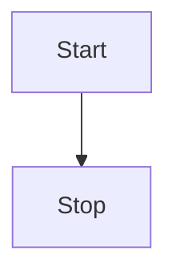

## 😲 markdown editor

Markdown 编辑器

### 🤖 基本演示

**加粗**，<u>下划线</u>，_斜体_，~~删除线~~，上标^26^，下标~1~，`inline code`，[超链接](https://github.com/tian-jing-ruo-feng/vite-ts-vue3.4-pro)

> 引用：《I Have a Dream》

1. So even though we face the difficulties of today and tomorrow, I still have a dream.
2. It is a dream deeply rooted in the American dream.
3. I have a dream that one day this nation will rise up.

- [ ] 周五
- [ ] 周六
- [x] 周天

## 🤗 代码演示

```vue
<template>
	<div>Hello Vue3</div>
</template>

<script setup>
import { ref } from 'vue'
</script>
```

## 🖨 文本演示

依照普朗克长度这项单位，目前可观测的宇宙的直径估计值（直径约 930 亿光年，即 8.8 × 10<sup>26</sup> 米）即为 5.4 × 10<sup>61</sup>倍普朗克长度。而可观测宇宙体积则为 8.4 × 10<sup>184</sup>立方普朗克长度（普朗克体积）。

## 📈 表格演示

| 表头 1 |  表头 2  | 表头 3 |
| :----- | :------: | -----: |
| 左对齐 | 中间对齐 | 右对齐 |

## 📏 公式

行内：$x+y^{2x}$

$$
\sqrt[3]{x}
$$

## 🧬 图表



## 🪄 提示

!!! note 支持的类型

note、abstract、info、tip、success、question、warning、failure、danger、bug、example、quote、hint、caution、error、attention

!!!
